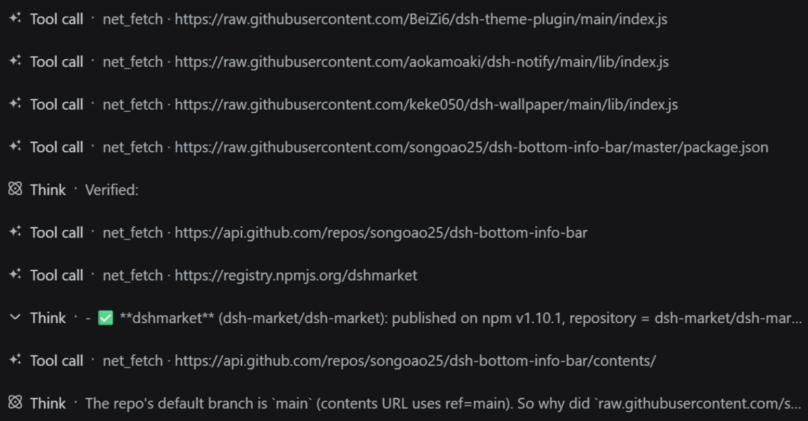

# dsh-net-tools

**Give DSH your magic**: plug sandboxed agents into your local HTTP proxy and
fetch blocked sites, docs and APIs in one shot.

[简体中文](README.md) · English

## 🤖 About this project

This project is developed and maintained **entirely by AI**: all code, tests
and docs are generated by an AI (a DeepSeek Harness coding agent); humans only
review, accept and publish the results.

## Problem

When DSH runs commands inside its file sandbox (`workspace-write`), Windows
`schannel`-based TLS (curl, PowerShell) cannot acquire credentials, so every
HTTPS request fails with `SEC_E_NO_CREDENTIALS`. Node.js ships its own TLS
stack and is unaffected — but the sandboxed shell still can't reach the
network reliably, and the user's local proxy (e.g. `127.0.0.1:7897`) is only
used if every tool remembers to pass it.

## What this bundle does

Tools run in the DSH Host process (Node.js), outside the file sandbox, so TLS
works. The bundle:

- **`net_fetch`** — fetch an HTTP(S) URL through the user's proxy via a manual
  CONNECT tunnel (no schannel, no dependencies). Follows redirects, enforces
  timeouts / size caps / SSRF guards, returns text or a truncated body.
- **`net_proxy_status`** — report which proxy (if any) DSH processes will use:
  user-level env vars, current-process env, and the Windows system proxy.

Proxy discovery order: explicit `proxy` argument → `HTTPS_PROXY` / `HTTP_PROXY`
env → Windows system proxy (registry `Internet Settings`).

## Install

```sh
dsh plugin --profile web add <this-package>
# or: dsh plugin --profile desktop add <this-package>
```

Reload/restart DSH, then the tools are available to the agent.

## Usage

Fetch a page through the proxy:

```
net_fetch(url: "https://github.com/")
→ [200] https://github.com/ (via proxy) 1212ms …
```

Diagnose proxy configuration:

```
net_proxy_status(checkReachability: true)
→ effective: http://127.0.0.1:7897
  proxy reachable: true
  probe: [204] https://www.gstatic.com/generate_204 ok=true
```

In action: the agent chaining `net_fetch` calls while thinking (screenshot):



## Tests

```sh
npm test
# inside the sandbox, where spawning test subprocesses is blocked, run in-process:
node --test --test-isolation=none test/fetch.test.js
```

## Security

- Scheme restricted to `http:` / `https:`
- SSRF guard: private/loopback/link-local targets rejected by default
  (`allowPrivate: true` opts in)
- Response size capped (default 1 MiB), timeout capped (default 30 s)
- Redirects limited (5) and re-validated against the same guards

## License

[MIT](LICENSE) © 2026 [izwarm195](https://github.com/izwarm195)
